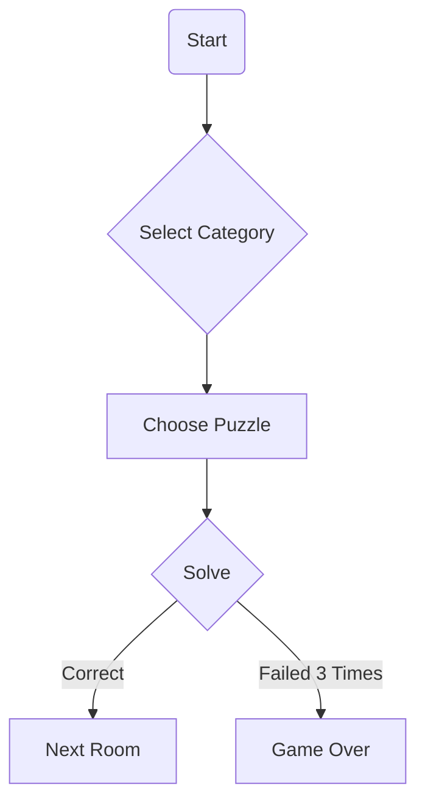

# Freedom Not Found - 404

## Overview

_You wake up inside a locked room. Nothing around you makes sense. Every door is sealed by logic, language, and code. The walls whisper riddles, the floor hums with data, and the air tastes of encryption._

Welcome to **Freedom Not Found - 404**, a terminal-based puzzle adventure. Each solved riddle pushes you deeper into a digital labyrinth. Written in Java, the game draws its puzzles from a MariaDB database and ramps up the difficulty as you progress.


## Features

- **Multiple Categories** – Tackle puzzles tagged as `RIDDLE`, `SQL`, `CIPHER` or `NUMBER`.
- **Room Based Progression** – Each puzzle belongs to a themed room with its own short narrative.
- **Retry Limit** – Three wrong answers lock the current room.
- **Dynamic Loading** – Puzzles are read from the database at runtime.

## Running the Game

1. Ensure Java 17 and MariaDB are installed.
2. Create the database using `schema.sql` and populate it using `data.sql` from `src/main/resources/sql`.
3. Compile and run:
   ```bash
   mvn package
   java -cp target/freedom-not-found-404-1.0-SNAPSHOT.jar com.pluralsight.freedom404.app.Main
   ```

## Project Structure

```
src/
└── main/
    ├── java/
    │   └── com/pluralsight/freedom404/
    │       ├── app
    │       ├── core
    │       ├── db
    │       ├── model
    │       └── util
    └── resources/
        ├── config.yml
        └── sql/
            ├── schema.sql
            └── data.sql
```

## Game Flow



Along the way you'll craft tools in Minecraft, cast spells from Harry Potter and train Pokémon allies. Every puzzle solved reveals a new fragment of the story and brings you closer to freedom.
